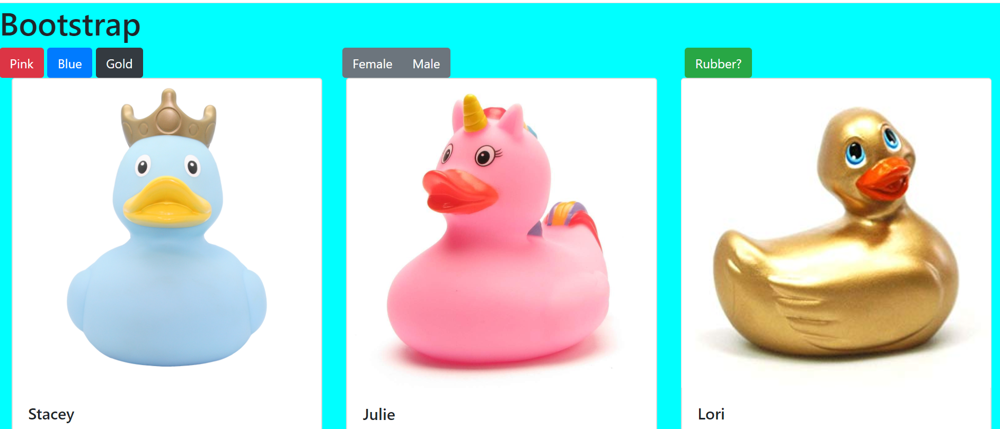

# Bootstrap
 ## Description
This project is an explorations into the bootstrap grid system  We used bootstrap cards to display a collection of ducks (both real and rubber).  We also give our users the ability to filter the fucks by color, gender, and if they are rubber.  

 ## Screenshots
 
 ## How to Run
1. Clone down this repo
1. Make sure you have  http-serve installed via npm. If not, get it [HERE](https://npmjs.com/package/http-server).
1. On your command line run `hs -p 9999`
1. In your browser go to `http://localhost:9999`

